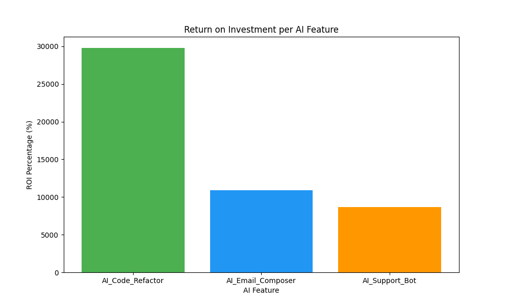

# AI ROI Tracker 📊

## Overview

AI ROI Tracker is a simple analytics tool that helps measure the **Return on Investment (ROI) of AI features** used in a product or application.
It analyzes user interaction data and visualizes how different AI features contribute to business value.

This project helps product teams understand:

* Which AI features are actually used by users
* How much value those features generate
* Whether an AI feature is worth maintaining or improving

---

## Problem Statement

Many companies add AI features to their products, but they often struggle to answer:

* Are users actually using these AI features?
* Do these features generate measurable value?
* Which AI feature provides the best ROI?

AI ROI Tracker solves this by tracking usage and calculating ROI metrics.

---

## Features

* 📈 Tracks usage of AI features
* 💰 Calculates ROI based on feature interactions
* 📊 Generates visualization charts
* 🗂 Stores feature interaction logs
* 🧠 Helps product teams make data-driven decisions

---

## Project Structure

```
AI-ROI-Tracker
│
├── app.py                # Main application
├── code.py               # Feature usage logic
├── project.py            # ROI calculation module
├── ai_feature_logs.csv   # Dataset containing feature interactions
├── roi_chart.png         # Generated ROI visualization
└── README.md
```

---

## How It Works

1. The system collects **AI feature usage data** from users.
2. The data is stored in a **CSV log file**.
3. ROI metrics are calculated based on usage and value contribution.
4. A **visual chart** is generated to show the impact of each AI feature.

---

## Technologies Used

* Python
* Data Analysis
* Visualization Libraries
* CSV Data Processing

---

## Example Output

The system generates a visualization showing the ROI contribution of different AI features.

Example chart:



---

## Installation

Clone the repository

```bash
git clone https://github.com/shruthi-dev09/AI-ROI-Tracker.git
```

Go to the project folder

```bash
cd AI-ROI-Tracker
```

Run the application

```bash
python app.py
```

---

## Future Improvements

* Real-time data dashboard
* Integration with product analytics tools
* Automated ROI reporting
* Machine learning based ROI prediction

---

## Author

Shruthi Durki
AIML Student | AI Developer

---

## License

This project is open-source and available for educational purposes.
